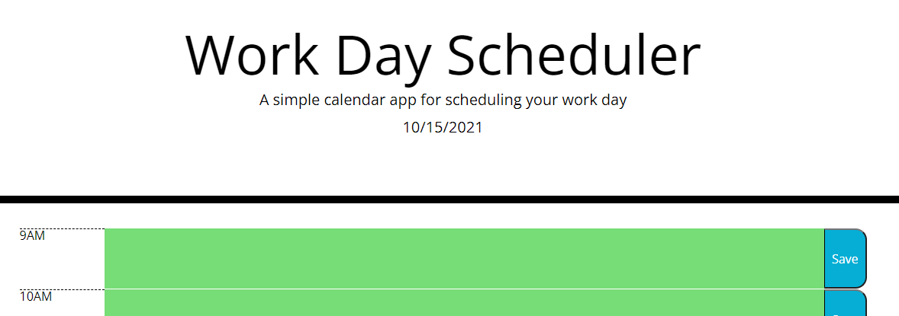

# Work Day Scheduler

[Github](https://github.com/evan-ebert17/Work-Day-Scheduler/)  
[Deployed Application](https://evan-ebert17.github.io/Work-Day-Scheduler/)

## Screen Shots
 

##### Table of Contents  
[Purpose](#purpose)  
[Features](#features)  
[Technologies Used](#technologies-used)  
[Installation](#installation)  
[Usage](#usage)  
[Credits](#credits)  
[License](#license)  

## Purpose  
This project is a web-based planner that you can use to write notes and save them based on a 9 to 9 day. Everything highlighted in green is your day to come, red is the current hour and grey has already happened. Wheever you click the save button, you are alerted that you have saved. From there, you may refresh your page, whatever you'd like, and your notes will stay there.

## Features 
CSS that changes based on time of the day, the ability to take notes, leave the application, and come back and have it be still there.

## Technologies-Used  
Currently made with JavaScript and HTML5/CSS.

## Installation  
There is no need to install this application for use, because it is hosted at the links provided above. However, for code inspection or etc, if you have SSH Keys linked, you can simple use your terminal and clone the repo down, otherwise, the typical zip.

## Usage  
By using localStorage, we are able to have the user notes persist after they are created. Additionally, this project uses JQuery for some shorthand loading of the user-saved content to the page and to have the window load everything.

## Credits
This project was made by  
[Evan Ebert](https://github.com/evan-ebert17)

## License

Copyright 2021 Evan Ebert

Permission is hereby granted, free of charge, to any person obtaining a copy of this software and associated documentation files (the "Software"), to deal in the Software without restriction, including without limitation the rights to use, copy, modify, merge, publish, distribute, sublicense, and/or sell copies of the Software, and to permit persons to whom the Software is furnished to do so, subject to the following conditions:

The above copyright notice and this permission notice shall be included in all copies or substantial portions of the Software.

THE SOFTWARE IS PROVIDED "AS IS", WITHOUT WARRANTY OF ANY KIND, EXPRESS OR IMPLIED, INCLUDING BUT NOT LIMITED TO THE WARRANTIES OF MERCHANTABILITY, FITNESS FOR A PARTICULAR PURPOSE AND NONINFRINGEMENT. IN NO EVENT SHALL THE AUTHORS OR COPYRIGHT HOLDERS BE LIABLE FOR ANY CLAIM, DAMAGES OR OTHER LIABILITY, WHETHER IN AN ACTION OF CONTRACT, TORT OR OTHERWISE, ARISING FROM, OUT OF OR IN CONNECTION WITH THE SOFTWARE OR THE USE OR OTHER DEALINGS IN THE SOFTWARE.
